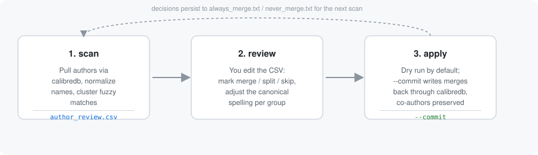
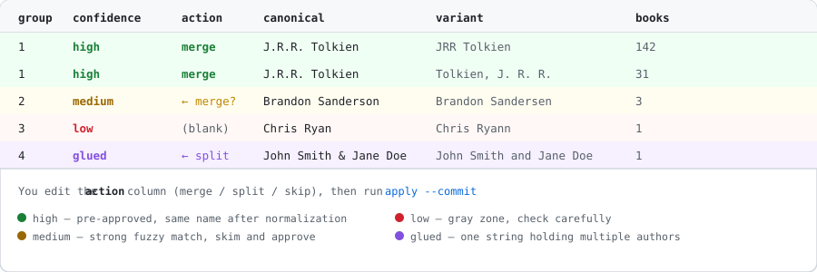

# calibre-author-cleanup

[](LICENSE)


Cluster, review, and merge duplicate author entries in a large Calibre
library — built for libraries too big to eyeball in Manage Authors
(tested at 100k+ books).

It sits alongside Calibre's own **Find Duplicates** plugin rather than
replacing it: use Find Duplicates for the GUI-driven merge, and this
script for normalization, typo-level fuzzy clustering, glued co-author
splitting, and a persistent decision log so re-runs get quieter over
time.



## What it catches

- **Normalization first** — diacritics (`José` / `Jose`), initials in
  any style (`JRR` / `J.R.R.` / `J. R. R.`), `Last, First` reordering,
  stray spacing and casing. These collapse to one group automatically
  and are pre-approved as safe merges.
- **Last-name typos** — e.g. `Brandon Sandersen` vs `Brandon Sanderson`
  — caught by fuzzy matching blocked on first-initial + name prefix, so
  it doesn't have to compare every author against every other author.
- **Glued co-authors** — `John Smith and Jane Doe` or
  `Neil Gaiman; Terry Pratchett` stored as one author string — flagged
  for a `split` action instead of a merge.
- **Suffix safety** — `Robert Jordan` vs `Robert Jordan Jr.` is
  deliberately kept at low confidence rather than auto-merged, since
  that can be two different people.
- **Smart canonical picks** — the winning spelling favors the form
  with the most books, then clean capitalization, full words over bare
  initials, and no stray commas or double spaces.
- **Decisions that persist** — every approval and rejection is written
  to `always_merge.txt` / `never_merge.txt`, so re-scanning the library
  later won't re-surface settled calls.

## Install

```bash
pip install rapidfuzz
git clone https://github.com/gmwestrup/calibre-author-cleanup.git
cd calibre-author-cleanup
pip install -e .
```

Or without installing the package, just run the script directly:

```bash
pip install rapidfuzz
python3 calibre_author_cleanup/cli.py scan --library /path/to/CalibreLibrary
```

Requires `calibredb` on your `PATH` (it ships with Calibre; on a
Docker/NAS setup, run this from inside the Calibre container or point
it at a library on a mounted volume).

## Usage

```bash
# 1. Scan and cluster — writes author_review.csv
calibre-author-cleanup scan --library /path/to/CalibreLibrary

# 2. Open author_review.csv and set the `action` column per row:
#      merge  — fold this variant into the group's canonical name
#      split  — this is a glued multi-author string; canonical holds
#               the split-out names joined with " & "
#      skip   — reject; recorded in never_merge.txt so it won't come
#               back on a future scan
#    (leave blank to ignore for now)
#    You can also edit the `canonical` value on any row to pick a
#    different winning spelling for that group.
```



```bash
# 3. Preview the changes (always the default — nothing is written)
calibre-author-cleanup apply --library /path/to/CalibreLibrary

# 4. Apply for real
calibre-author-cleanup apply --library /path/to/CalibreLibrary --commit
```

### No calibredb access?

Scan a plain text file instead (one author name per line, e.g.
exported from `calibredb list_categories`):

```bash
calibre-author-cleanup scan --authors-file authors.txt
```

### Tuning match sensitivity

```bash
calibre-author-cleanup scan --library /path/to/CalibreLibrary \
  --threshold 93 \   # fuzzy score cutoff for "medium" confidence (0-100)
  --gray 86           # lower bound shown as "low" confidence
```

Raise `--threshold` for fewer, safer suggestions; lower it (and
`--gray`) to surface more candidates for manual review.

## Confidence levels in the review CSV

| Level  | Meaning                                                  | Pre-marked? |
|--------|-----------------------------------------------------------|-------------|
| high   | Identical after normalization (accents, initials, casing) | `merge`     |
| medium | Strong fuzzy match — likely the same person               | blank       |
| low    | Gray-zone match — check carefully before merging          | blank       |
| glued  | One string holding multiple authors                       | blank       |

## Safety

- **Nothing is written without `--commit`.** The default `apply` run
  is always a dry run that prints exactly what would change.
- Back up `metadata.db` and stop any web front-end (Calibre-Web,
  Calibre-Web Automated, etc.) before running with `--commit` — bulk
  writes while another process holds the database open risks
  corruption.
- Co-authors on a book are preserved and deduplicated; merging one
  author on a multi-author book doesn't touch the others.
- Single-author merges also get a correct `Last, First` `author_sort`
  set to keep sorting consistent after the merge.
- After a real run: **Library → Check Library** in Calibre to confirm
  the database and on-disk folders agree, then restart your web
  front-end.

## How clustering works

1. Pull the full author list (`calibredb list_categories`) or read
   from `--authors-file`.
2. Normalize each name to a matching key: strip diacritics, reorder
   `Last, First`, collapse initials, drop punctuation.
3. Group exact key matches as `high` confidence.
4. Block remaining names by first-initial + last-name prefix, then run
   fuzzy scoring (`rapidfuzz.fuzz.token_sort_ratio`) within each
   bucket — this keeps the comparison count manageable even at tens of
   thousands of authors, instead of an all-pairs comparison.
5. Detect glued co-author strings via separator patterns (`and`, `;`,
   `/`, `with`).
6. Write everything to `author_review.csv` for a human decision.

## License

MIT — see [LICENSE](LICENSE).

## Changelog

See [CHANGELOG.md](CHANGELOG.md) for a history of changes.
